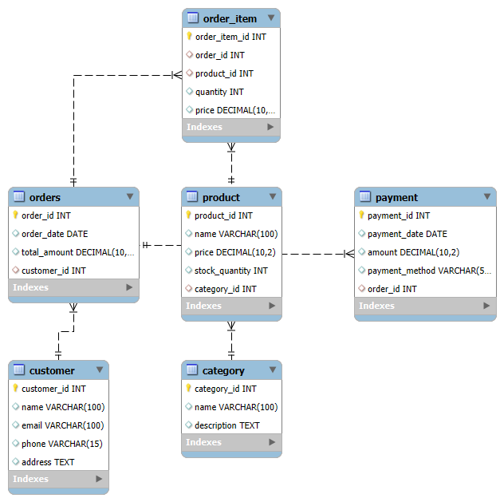

# E-commerce Database Schema

## Description
This is an E-commerce database schema designed using MySQL.

## Tables:
- Customer
- Category
- Product
- Orders
- Order_Item
- Payment

## How to Run:
- Open `create_schema.sql` in MySQL Workbench
  1️⃣ Open MySQL Workbench
  2️⃣ Go to top menu:
  👉 File → Open SQL Script...
  3️⃣ Select this .sql file (your dump)
  
  4️⃣ It will open in an editor tab.
  
  5️⃣ Press the Yellow Lightning Bolt ⚡ Execute All (or Ctrl + Shift + Enter)
  - Execute the script to create the database and tables

## ER Diagram:

